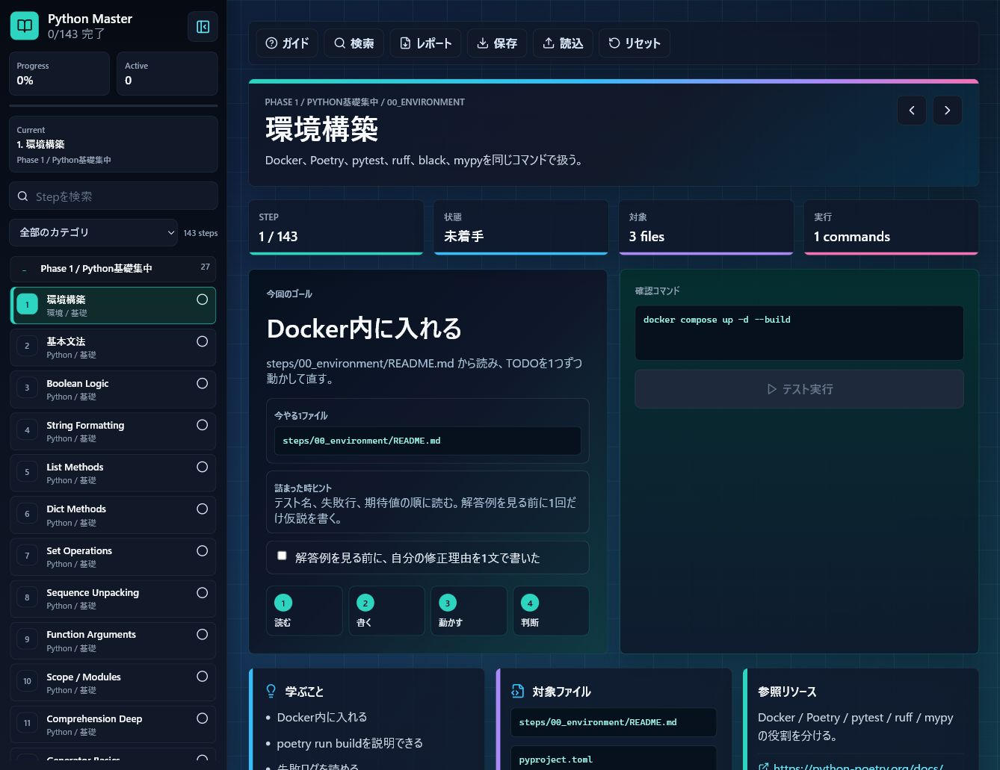

# Python Master

Docker コンテナ内で Python 3 を学び、既存プロジェクトに参画した時に「読める・書ける・直せる・判断できる・提案できる」状態を目指す学習環境です。

## 完成状態

このリポジトリは、Docker だけで Python 学習環境、MongoDB、実行API、Vue/TypeScript の学習UIまで起動できる状態です。

- ローカルに Python / Node.js / npm / pnpm がなくても起動可能
- 初期表示は `http://localhost:5173/#home`
- Stepごとに「問題」「学ぶこと」「書くファイル」「参照リソース」「実行コマンド」を確認可能
- UI上の `実行` から許可済みコマンドを実行可能
- Stepの完了チェックは、対象テストが成功した時だけ付く
- ホームで効率ルート、苦手カテゴリ、今日やるStepを確認可能
- RAG可視化、MongoDB練習、レビュー課題、解答例比較をAPIキーなしで利用可能
- GitHub Actions で Docker build、Python品質チェック、frontend test/e2e/build を確認

## 起動

Windows PowerShell / macOS Terminal 共通です。

```bash
docker compose up -d --build
```

ブラウザで次を開きます。

- 学習UI: `http://localhost:5173/#home`
- 実行API: `http://localhost:8000`

コンテナに入って直接操作する場合:

```bash
docker compose exec app bash
```

Vue と実行APIは hot reload 対応です。`frontend/`、`tools/`、`docs/` の変更は保存後に反映されます。

Docker Desktop では次の固定名で表示されます。

- `python-master-frontend`: Vue/TypeScript 学習UI
- `python-master-api`: UI実行用API
- `python-master-app`: Python学習用コンテナ
- `python-master-mongo`: 練習用MongoDB
- `python-master-mongo-express`: MongoDB確認UI

## 画面でできること



- ホーム: 効率ルート、苦手カテゴリ、今日の候補、学習状況を見る
- Step画面: 問題、学ぶこと、注意点、参考URL、対象ファイルを見る
- 実行: UIから `pytest` / `poetry run ...` など許可済みコマンドを実行する
- 比較: 自分の答えと `solutions/` を見比べる
- 実務ラボ: レビュー練習、RAG可視化、Mongoコマンド確認、メモを使う
- 絞り込み: 今日、未完了、基礎復習、軽量モードで学習量を調整する
- リセット: 進捗と学習ログを最初からやり直す

ショートカット:

- `j`: 次のStep
- `k`: 前のStep
- `r`: 現在Stepの主コマンドを実行
- `/`: Step検索を開く
- `s`: サイドバー開閉
- `l`: 軽量モード切り替え
- `h`: ホームへ戻る
- `Esc`: モーダルを閉じる

コンテナ内で使う基本コマンド:

```bash
python --version
pytest -q
ruff check .
black --check .
mypy src
```

MongoDB に入る:

```bash
docker compose exec mongo mongosh
```

MongoDBをブラウザで見たい時だけ、tools profileを使います。

```bash
docker compose --profile tools up -d mongo-express
```

`http://localhost:8081` を開きます。

初回起動時は `docker/mongo-init/01_seed.js` が自動実行され、`python_master` DB に練習用データが入ります。
既存の `mongo_data` volume がある場合は自動実行されないため、再投入したい時は次を実行します。

```bash
docker compose exec mongo mongosh /docker-entrypoint-initdb.d/01_seed.js
```

## Windows / Mac 共通コマンド

Docker Desktop を起動してから、プロジェクト直下で同じコマンドを使います。

```bash
docker compose up -d --build
docker compose exec app bash
poetry run lint
poetry run fmt
poetry run fmt --fix
poetry run build
```

基本は Docker 内で作業すれば、Windows/Mac の差をほぼ気にせず進められます。

## CI / リリース確認

GitHub Actions は `.github/workflows/ci.yml` で次を実行します。

- `docker compose build app frontend`
- `docker compose run --rm --no-deps app poetry run build`
- `docker compose run --rm --no-deps frontend pnpm test`
- `docker compose run --rm --no-deps frontend pnpm test:e2e`
- `docker compose run --rm --no-deps frontend pnpm build`

ローカルで同じ確認をするなら:

```bash
docker compose run --rm --no-deps app poetry run build
docker compose run --rm --no-deps frontend pnpm test
docker compose run --rm --no-deps frontend pnpm test:e2e
docker compose run --rm --no-deps frontend pnpm build
```

## トラブルシュート

- 画面が開かない: `docker compose ps` で `frontend` と `api` が起動しているか確認
- UI実行が失敗する: `docker compose logs -f api` でAPIログを確認
- Mongo初期データがない: `docker compose exec mongo mongosh /docker-entrypoint-initdb.d/01_seed.js`
- 依存が壊れた: `docker compose down` 後に `docker compose up -d --build`
- 進捗をやり直す: 画面上部の `リセット` を使う

## 進め方

1. `steps/00_environment` から順番に README を読む
2. `src/mastery/` のコードを書く、または修正する
3. `pytest -q` で正しいか確認する
4. `ruff check .`、`black --check .`、`mypy src` で品質を確認する
5. AI に出力させたコードは `steps/57_ai_review` の観点でレビューする

## Poetry

依存関係は `pyproject.toml` に書きます。

```bash
poetry --version
poetry install
poetry run pytest -q
poetry run lint
poetry run fmt
poetry run fmt --fix
poetry run build
```

コマンドの意味:

- `poetry run lint`: `ruff check .` と `mypy src`
- `poetry run fmt`: フォーマット確認
- `poetry run fmt --fix`: 自動修正
- `poetry run build`: `fmt`、`lint`、`pytest -q`

## Python 基礎をたくさん書く

まずは `exercises/basics/01_values.py` から順番に TODO を埋めます。

```bash
pytest exercise_tests -q
```

最初は大量に失敗します。1ファイルずつ直すなら次のように実行します。

```bash
pytest exercise_tests/basics/test_01_values.py -q
```

基礎チェック表は `notes/python_basics_checklist.md` です。

反復練習は `exercises/basics_repetition/` です。

```bash
pytest exercise_tests/basics_repetition/test_round_01.py -q
pytest exercise_tests/basics_repetition/test_round_02.py -q
pytest exercise_tests/basics_repetition/test_round_03.py -q
pytest exercise_tests/basics_repetition/test_round_04.py -q
pytest exercise_tests/basics_repetition/test_round_05.py -q
```

反復は `round_01` から `round_55` まであります。まとめて実行:

```bash
pytest exercise_tests/basics_repetition -q
```

## 濃い読み物

- `docs/CURRICULUM.md`: 全体の学習設計
- `docs/FASTAPI_AI_ARCHITECTURE.md`: FastAPI で AI API を作る設計
- `docs/REVIEW_CHECKLIST.md`: コードレビュー観点
- `docs/STEP_REFERENCES.md`: 各 step の理解コメントと参考URL
- `docs/BASICS_REPETITION_PLAN.md`: 基礎反復の進め方
- `docs/mongosh/COMMANDS.md`: mongosh コマンド集
- `docs/mongosh/PRACTICE.md`: mongosh 練習メニュー

## マスター用追加教材

- `solutions/`: 解答例
- `failure_patterns/`: 失敗パターン集
- `review_tasks/`: 汚いコードのレビュー課題
- `write_tests/`: 自分でテストを書く課題
- `debugging/`: traceback、breakpoint、ログ調査
- `design_memos/`: 設計判断メモ
- `projects/ai_review_api/`: FastAPI + MongoDB + AI の実務ミニプロジェクト

## Step 一覧

番号順に進めます。

- `00_environment`: Docker、pytest、ruff、mypy の使い方
- `01_syntax`: 基本文法、関数、例外、型ヒント
- `02_typing_deep`: Python の型ヒント、TypedDict、Protocol、Generic
- `03_files`: ファイル操作、JSON、CSV、パス操作
- `04_datetime_timezone`: UTC、JST、aware / naive datetime
- `05_testing_deep`: fixture、fake client、parametrize 発想
- `06_core_design_thinking`: 冪等性、境界値、不変条件、状態遷移、fail fast
- `07_logging`: logger、ログレベル、秘匿情報マスク、例外ログ
- `08_observability`: request id、structured logging、metrics
- `09_project_reading`: 既存コードを読んでバグ修正
- `10_refactoring`: 関数分割、重複削除、仕様維持
- `11_package_design`: import の向き、public/private API
- `12_app_layers`: model.py、service.py、router.py の責務分け
- `13_design_patterns`: factory、strategy、adapter
- `14_advanced`: 設定、Repository、独自例外、ページング、キャッシュ、リトライ
- `15_pydantic_validation`: validator、enum、nested schema
- `16_fastapi`: FastAPI、schema/router/service、TestClient
- `17_dependency_injection`: Depends、repository / client 差し替え
- `18_auth`: API key、Bearer token、role / permission
- `19_error_handling`: domain error、HTTP error、retry 判断
- `20_security`: prompt injection、path traversal、secret leakage
- `21_api_design`: pagination、sorting、error response、idempotency
- `22_network_api`: HTTP、API、JSON、ステータスコード
- `23_api_client`: timeout、retry、backoff、rate limit
- `24_async`: asyncio、gather、timeout
- `25_async_fastapi`: async def、gather、stream の基礎
- `26_concurrency_practice`: semaphore、concurrent API calls、cancel
- `27_processes`: subprocess、multiprocessing、外部プロセス操作
- `28_performance`: generator、chunk処理、計測
- `29_n_plus_one_performance`: N+1 問題、bulk取得、chunk処理、query数
- `30_sql`: SQLite CRUD
- `31_mongo`: MongoDB と mongosh、Python からの DB 操作
- `32_mongosh_commands`: mongosh コマンド集、検索、更新、集計、index、explain
- `33_mongo_aggregation`: MongoDB aggregation pipeline
- `34_mongo_deep`: index、compound index、upsert、explain
- `35_transactions`: transaction、rollback、整合性
- `36_cache`: TTL cache、cache key
- `37_job_queue`: queue、job status、retry
- `38_file_db_export`: DB からデータを取り出して CSV 化
- `39_docs_pdf`: docs を分割して PDF 化
- `40_data_analysis`: クリーニング、欠損、重複、集計
- `41_pandas_excel`: pandas、CSV、Excel 出力
- `42_log_analysis`: JSONL ログ分析、エラー率、処理時間
- `43_model_mapping`: deployment_name から model_name への対応管理
- `44_google_ai`: Gemini API、Vertex AI、Gen AI SDK
- `45_langchain`: LangChain の基本構造
- `46_langgraph`: LangGraph の状態遷移
- `47_rag_basics`: 文書分割、簡易類似検索、RAG 基礎
- `48_rag_deep`: chunk、retriever、context、RAG 評価
- `49_rag_advanced`: hybrid search、metadata filtering、rerank
- `50_rag_practice`: answerable、citation、rerank、chunk size 比較
- `51_llm_ops`: prompt versioning、fallback、guardrails、cost
- `52_ai_streaming`: token streaming、SSE
- `53_batch_inference`: JSONL、Vertex AI / Gemini バッチ推論の設定
- `54_ai_evaluation`: AI 出力評価、正解率、prompt 比較
- `55_ai_agents`: tool calling、planner、memory、human review
- `56_fastapi_ai`: FastAPI で AI service を API 化
- `57_ai_review`: AI 出力を疑い、テストと観点で判断する
- `58_capstone`: 小さな実務風プロジェクト
- `59_cli_tools`: argparse、CLI引数、dry-run
- `60_static_typing_practice`: TypedDict、union型、型の絞り込み
- `61_domain_modeling`: dataclass、自治体subscription、業務ルール
- `62_api_pagination_deep`: cursor pagination、limit、next_cursor
- `63_etl_pipeline`: stream処理、extract/transform/load
- `64_resilience_patterns`: retry、backoff、失敗分類
- `65_webhooks_events`: HMAC署名、event冪等性
- `66_ci_debugging`: GitHub Actionsログ、pytest失敗行
- `67_docker_ops`: healthcheck、env、degraded状態
- `68_vector_search_basics`: cosine similarity、top-k検索
- `69_ai_cost_control`: token budget、model limit、model選択
- `70_schema_evolution`: backfill、migration、schema互換性
- `71_git_workflow`: git status、ahead/behind、差分確認
- `72_review_comments`: severity、問題、修正案
- `73_feature_flags`: rollout、段階リリース、緊急停止
- `74_settings_secrets`: 必須設定、secret mask、公開設定
- `75_rate_limiting`: fixed window、429、retry after
- `76_background_tasks`: job状態、idempotency key
- `77_scheduler_cron`: due判定、定期実行、再実行安全性
- `78_data_contracts`: required fields、schema version、互換性
- `79_openapi_contract`: OpenAPI、method/path/status
- `80_mocking_external_services`: fake client、呼び出し履歴
- `81_property_based_thinking`: 冪等性、正規化、不変条件
- `82_memory_profiling`: chunk size、メモリ上限
- `83_streaming_files_large`: 巨大ファイル、line stream
- `84_debugging_deep`: traceback、例外名、file/line
- `85_architecture_decision_records`: ADR、設計判断メモ
- `86_boolean_logic`: bool条件、truthy/falsy
- `87_string_formatting_parsing`: f-string、split、strip、join
- `88_sequence_unpacking`: tuple unpacking、*rest
- `89_function_arguments`: default、keyword-only、option
- `90_scope_modules`: scope、module定数、public関数
- `91_list_methods`: append、extend、非破壊更新
- `92_dict_methods`: get、count、merge
- `93_set_operations`: unique、intersection、difference
- `94_comprehension_deep`: list/dict/set内包表記
- `95_iterable_generator_basics`: iterable、generator、yield
- `96_pathlib_glob`: Path、suffix、ファイル名
- `97_custom_exceptions`: 独自例外、validation
- `98_prompt_templates`: prompt template、必須変数、message分割
- `99_prompt_injection_defense`: prompt injection検出、untrusted context
- `100_structured_output_parsing`: AI JSON出力、required fields
- `101_tool_calling_contracts`: tool allowlist、arguments検証
- `102_conversation_memory`: 会話履歴trim、system保持
- `103_embedding_chunk_metadata`: chunk id、metadata、source
- `104_vector_db_index_design`: dimension、metric、filter fields
- `105_rag_query_rewriting`: query正規化、synonym、metadata filter
- `106_rag_citation_verification`: citation検証、answerable判定
- `107_ai_safety_filters`: PII mask、unsafe intent
- `108_model_fallback_routing`: task別model、fallback判断
- `109_ai_observability_traces`: request_id、latency、token/cost
- `110_ai_regression_dataset`: 回帰評価dataset、model別正解率
- `111_domain_ai_requirements`: 特化型AIの対象業務、利用者、成功条件、対象外
- `112_domain_knowledge_taxonomy`: 業務知識の分類、用語、ルール、例外
- `113_domain_dataset_curation`: 専門データの収集、重複除去、PII除外、分割
- `114_domain_evaluation_rubric`: 専門家目線の評価軸、重み、合格条件
- `115_expert_feedback_loop`: 専門家レビュー、修正理由、再学習候補
- `116_domain_rag_blueprint`: 特化型RAGのsource、chunk、metadata、citation設計
- `117_finetuning_dataset_prep`: fine-tuning用JSONL、役割、禁則、検証
- `118_domain_guardrails_policy`: 業務特化AIの回答制限、確認質問、拒否条件
- `119_specialized_ai_api_design`: 特化型AI APIのrequest/response、trace、評価情報
- `120_domain_ai_release_checklist`: 評価、ログ、安全性、fallback、監視のリリース判定
- `121_collections_deep`: Counter、defaultdict、deque
- `122_itertools_functools`: groupby、partial、lru_cache
- `123_dataclass_deep`: frozen、default_factory、値オブジェクト
- `124_context_manager_deep`: with、__enter__、__exit__、contextmanager
- `125_typing_extras`: Literal、Final、TypeAlias、NewType、cast
- `126_import_module_deep`: public/private、__all__、循環import
- `127_regex_practical`: validation、extract、replaceの正規表現
- `128_algorithm_complexity`: 探索、重複除去、sort key、計算量
- `129_error_design_deep`: retryable/permanent error、validation、例外分類
- `130_fastapi_middleware_lifespan`: middleware、CORS、lifespan
- `131_fastapi_files_websocket`: file upload、path traversal対策、WebSocket
- `132_auth_jwt_rbac`: Bearer token、JWT claim、RBAC
- `133_mongo_ops_schema`: compound index、schema validation、slow query
- `134_worker_dead_letter`: worker retry、backoff、dead letter queue
- `135_data_analysis_stats`: 平均、中央値、IQR外れ値検出
- `136_ai_dataset_versioning`: dataset fingerprint、annotation、label分布
- `137_ai_ab_drift`: A/B test、conversion率、drift検知
- `138_rag_ops_quality`: reindex、search quality log、回答不能判定
- `139_security_scanning`: secret mask、脆弱性、権限漏れ
- `140_observability_slo`: error rate、burn rate、latency alert
- `141_deploy_release_strategy`: canary、blue/green、rollback
- `142_api_compatibility_design`: field削除、required追加、deprecation
